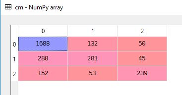

# Twitter US Airline Sentiment Classifier (Natural Language Processing #2)
> You can find the dataset <a href="https://www.kaggle.com/crowdflower/twitter-airline-sentiment/version/2#">here</a>

## Objective
To classify tweets made by travelers in February 2015 as Neutral, Positive or Negative.

### Model Used: Random Forest
I used the random forest classifier as the problem dealt with a relatively large dataset. Random Forests are also great classifiers when it comes to dealing with a large number of features.

## Code
The steps taken were as follows:
<ul>
  <li>Get the Dataset</li>
  <li>Pre-process the text</li>
  <li>Create the Bag of Words Model</li>
  <li>Label Encode and OneHot Encode the Dependent Variable</li>
  <li>Split the data into Test and Training sets</li>
  <li>Train the Random Forest Classifier</li>
  <li>Get the Predicted values of test set</li>
  <li>Compare the predicted and test values and use a confusion matrix to calculate the accuracy of the model. </li>
  <li>Accuracy = (number of correct predictions on testing data / total number of testing data) </li>
  <li>Repeat the process to maximize accuracy by varying:</li>
  <ul>
    <li>Max_features</li>
    <li>N_estimators </li> 
  </ul>
</ul>

#### Using max_features = 1600 and n_estimators = 550
</img> 
### I got an accuracy of 75.4% (2208/2928)
> Considering the fact that the classification was done for 3 categories and that the tweets may be ambiguous/poorly written, the 75% accuracy is acceptable, however is there a way to get better results? 
#### There's only ONE way to figure that out! 

